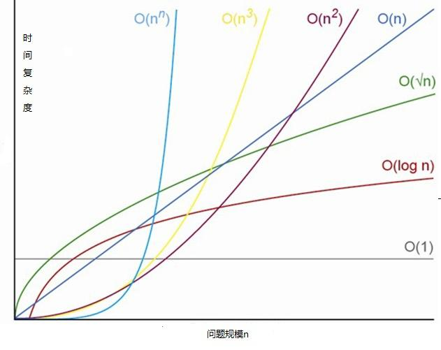

# 四叉树算法

## 一、简介 [百度百科](https://baike.baidu.com/item/%E5%9B%9B%E5%8F%89%E6%A0%91/8557650?fr=aladdin)

* **概述** 四叉树（quad-tree）是一种数据结构，是一种每个节点最多有四个子树的数据结构。
* **直观damo** [外链](https://timohausmann.de/quadtree.js/simple.html)

## 二、基本概念

+ 根结点root: 有一个特定的结点被称为根结点或树根
  
+ 结点node: 每个元素称为结点
  
+ 结点的度: 一个结点含有的子树的个数
  
+ 叶子结点或终端结点: 度为0的结点

+ 树的高度或深度: 树的高度或深度是树中节点的最大层数（最长路径的长度）加1 ，空树高度为0，只有根节点的树高度为1

+ 四叉树参考结构：

```javascript
{
  "poiv":{
    "name":"我是节点深度为1的根节点",
    "log":123,
    "lat":12,
    ...//其他属性
  },
  "level":0,//记录当前节点的深度
  "children":[
    null,
    null,
    {
    "poiv":{
      "log":130,
      "lat":12,
      "name":"我是节点深度为二，在第三象限的poiv",
      ...//其他属性
    },
    "level":1,
    "children":[
      {...},
      null,
      {...},
      {...}
    ]
  },
  null]
}

```

## 三、案例 

### 一、使用背景

    项目背景：在地球模型中挂载上万甚至更多的点(poiv)，每个点都会有对应经纬度、高度、优先级、以及一些其他的信息。在不同的相机高度下，显示可视区域所有点或聚合点。若有多个点在比较靠近，需要进行点聚合样式，并显示在优先级最高的坐标位置。当高度下降时，对应的聚合点达到不聚合的条件，再显示对应的点样式。

    原先方案一： 遍历后端返回的大数组。去判断每个点坐标是否屏幕显示范围内，且是否要以聚合点的形式显示（其中每个点都有属性：level 显示的最小level条件、no_neighborhood_level：当大于该层级时不进行聚合否则为聚合点）。过滤出来的点以html的形式挂载在地球上

    原先方案二： 将后端返回的大数组，以dataSource的形式塞入地球渲染，使用cesium的自动聚合进行按优先级进行聚合 （该方案测试了当达到几万数据的，会出现界面卡顿）

    方案一、缺点是当数据过大时计算，每次屏幕移动后的计算量过大，时间复杂度 O(n)
    方案二、缺点是当数据过大时，cesium自身比较卡，估计是内部计算以及渲染比较耗新能

    综上原因，采用四叉树的数据结构，数据计算的时间复杂度是O(logn)

- 时间复杂度参考图:
<br>

  

### 二、实现思路及代码实现

  在实现代码前，先大概了解bingmap地图上，切片的原理以及实现 这篇文章很详细 - [墨卡托投影、地理坐标系、地面分辨率、地图比例尺](https://www.cnblogs.com/gispathfinder/p/6087558.html) -> 代码可实现。项目中引用并修改为TileSyste.js

  理解完地图切片后，来梳理下四叉树的实现：

1. 分析：我们知道数万个点是分布在地球各地的，首先将地球划分为四等分，姑且定义为根节点上的一、二、三、四共四个象限，每个象限上会有一堆点。继续在分别对每个象限进行分割，这时是深度为2的节点。依次进行划分，直到单个象限中只有一个数据，或者到达树的最大深度（最大深度人为定义，项目中定位20），将深度为20的叶子节点多余不能进行划分的放入叶子节点的more字段

2. 思路：将数万个点一次推入一个空的四叉树，每当推入的点同一象限超过1个，就对该象限进行划分为四个象限。并将当前的level上的点设置为两个点中优先级（评分）高的点。在下一层级中继续判断两个点是否在同一象限，不一样则不用继续划分。若还在同一象限，就继续同样划分。直到两个点存在于不同象限，或者到达最深节点深度。存入more字段


+ 地图切片原理计算代码TileSyste.js

```javascript
/*
 * @Description: 
 * @Author: yanyuanfeng
 * @Date: 2022-01-28 10:45:48
 * @LastEditors: yanyuanfeng
 * @LastEditTime: 2022-01-28 18:50:59
 */
const EarthRadius = 6378137 //地球半径
const MinLatitude = -85.05112878 
const MaxLatitude = 85.05112878
const MinLongitude = -180
const MaxLongitude = 180
const TileSystem = {
  /**
   * 将数字剪裁为指定的最小值和最大值
   * @param {*} n 
   * @param {*} minValue 
   * @param {*} maxValue 
   */
  Clip(n,  minValue, maxValue){
    return Math.min(Math.max(n, minValue), maxValue);
  },
  /**
   * @param {*} levelOfDetail 
   * @returns  确定指定级别的贴图宽度和高度 
   */
  MapSize(levelOfDetail){
      return  256 << levelOfDetail;
  },
  /**
   * 地面分辨率  米/像素
   * @param {*} latitude 
   * @param {*} levelOfDetail 
   * @returns 确定指定纬度和level下的地面分辨率（以米/像素为单位）
   */
  GroundResolution(latitude, levelOfDetail){
   latitude =  this.Clip(latitude, MinLatitude, MaxLatitude);
    return Math.cos(latitude * Math.PI / 180) * 2 * Math.PI * EarthRadius / this.MapSize(levelOfDetail);
  },
  /**
   * 地图比例尺 1:xxx
   * @param {*} latitude 
   * @param {*} levelOfDetail 
   * @param {*} intscreenDpi  n 英寸/像素
   */
  MapScale(latitude,  levelOfDetail, intscreenDpi){
    return this.GroundResolution(latitude, levelOfDetail) * screenDpi / 0.0254;
  },
  /**
   * 将点从纬度/经度WGS-84坐标（以度为单位）转换为指定细节级别的像素XY坐标。
   * @param {*} latitude 
   * @param {*} longitude 
   * @param {*} levelOfDetail 
   * @returns 
   */
  LatLongToPixelXY( latitude,  longitude, levelOfDetail){
    latitude = this.Clip(latitude, MinLatitude, MaxLatitude);
    longitude = this.Clip(longitude, MinLongitude, MaxLongitude);
    let x = (longitude + 180) / 360; 
    let sinLatitude = Math.sin(latitude * Math.PI / 180);
    let y = 0.5 - Math.log((1 + sinLatitude) / (1 - sinLatitude)) / (4 * Math.PI);
    let mapSize = this.MapSize(levelOfDetail);
    return {
      pixelX : this.Clip(x * mapSize + 0.5, 0, mapSize - 1),

      pixelY : this.Clip(y * mapSize + 0.5, 0, mapSize - 1)
    }
  },
  /**
   * 将像素从指定细节级别的像素XY坐标转换为纬度/经度WGS-84坐标（以度为单位）。
   * @param {*} pixelX 
   * @param {*} pixelY 
   * @param {*} levelOfDetail 
   * @returns 
   */
  PixelXYToLatLong( pixelX,  pixelY, levelOfDetail){

    let mapSize = this.MapSize(levelOfDetail);
    let x = (this.Clip(pixelX, 0, mapSize - 1) / mapSize) - 0.5;
    let y = 0.5 - (this.Clip(pixelY, 0, mapSize - 1) / mapSize);
    let latitude = 90 - 360 * Math.Atan(Math.Exp(-y * 2 * Math.PI)) / Math.PI;
    let longitude = 360 * x;
    return {
      latitude,
      longitude
    }
  },
  /**
   * 将像素XY坐标转换为指定像素中平铺的平铺XY坐标。
   * @param {*} pixelX 
   * @param {*} pixelY 
   * @returns 
   */
  PixelXYToTileXY(pixelX, pixelY){
    let tileX = pixelX / 256;
    let tileY = pixelY / 256;
    return {
      tileX,
      tileY
    }
  },
  /**
   * 将平铺XY坐标转换为指定平铺的左上像素的像素XY坐标。
   * @param {*} tileX 
   * @param {*} tileY 
   * @returns 
   */
  TileXYToPixelXY(tileX, tileY){
    let pixelX = tileX * 256;

    let pixelY = tileY * 256;
    return {
      pixelX,
      pixelY
    }
  },
  /**
   * 将平铺XY坐标转换为指定详细级别的四键。
   * @param {*} tileX 
   * @param {*} tileY 
   * @param {*} levelOfDetail 
   * 二进制值交错
   */
  TileXYToQuadKey(tileX,tileY,levelOfDetail){
    let quadKey = ''
    for (let i = levelOfDetail; i > 0; i--) {
        let digit = '0';
        let mask = 1 << (i - 1);
        if ((tileX & mask) != 0)
        {
            digit++;
        }
        if ((tileY & mask) != 0)
        {
            digit++;
            digit++;
        }

        quadKey+=digit
      }
     return quadKey
  },
  /**
   * 将四键转换为平铺XY坐标。
   * @param {*} quadKey 
   * @returns 
   */
  QuadKeyToTileXY(quadKey){
    let tileX = 0;
    let tileY = 0;
    let levelOfDetail = quadKey.length;
    for (let i = levelOfDetail; i > 0; i--)
    {
        let mask = 1 << (i - 1);
        switch (quadKey[levelOfDetail - i])
        {
            case '0':
                break;
            case '1':
                tileX = tileX|mask;
                break;
            case '2':
                tileY = tileY|mask;
                break;
            case '3':
                tileX = tileX|mask;
                tileY = tileY|mask;
                break;
            default:
                throw new Error("Invalid QuadKey digit sequence.");
        }

    }

    return {
      tileX,
      tileY,
      levelOfDetail
    }
  },
  LatLongToQuadKey(latitude,longitude,levelOfDetail){
    let pixelXY = this.LatLongToPixelXY(latitude,longitude,levelOfDetail)
    let tileXY = this.PixelXYToTileXY(pixelXY.pixelX,pixelXY.pixelY)
    let quadKey = this.TileXYToQuadKey(tileXY.tileX, tileXY.tileY,levelOfDetail)
    return quadKey
  },
  
}
export default TileSystem
```
+ 四叉树代码

```javascript
// poiv：对象
{
   "id"
  "name"
  "title"
  "guide_question"
  "type"
  "category_type"
  "cover_image"
  "category_icon"
  "quadkey"
  "level"
  "latitude"
  "longitude",
  "position":{
    "latitude",
    "longitude",
    "poiv_height",
    "height":0
  }
  ...
}
// 四叉树节点构造器
export function PoivNode(poiv, level) {
  this.poiv = poiv;
  this.level = level;//这部分可以理解为四叉树的度，在地图上可以对应对应的高度level
  this.children = new Array(null, null, null, null); // 四个子节点
  //还有个this.more  一直到最底层quadkey都还一样，就把 poiv 全存在这个数组里。
}

PoivNode.prototype.MAX_LEVEL = 24; //调试时用3。正式环境用24

// 用于获取每一层对应唯一quadkey
PoivNode.prototype.qk = function() {
  if(this.level == 0) {
      return "";
  }
  return this.poiv.quadkey.slice(0, this.level);
}
// 向四叉树中添加节点（依据poiv中的quadkey,以及优先级score，推入到对应的层级）
PoivNode.prototype.addPoiv = function(poiv) {
  var newP = poiv;
  if(this.level > this.MAX_LEVEL) { // 已经到最底层，顺次添加到m数组中
      if(!this.more) {
          this.more = new Array(poiv);
      } else {
          this.more.push(poiv);
      }
      return;
  }
  if(this.poiv && this.poiv.score < poiv.score) {
      newP = this.poiv;
      this.poiv = poiv; //新添加的Poiv分数更高出现在更高层
  }

  var index = parseInt(newP.quadkey.charAt(this.level));
  if (index < 0 || index > 3) {
      throw new Error("quadkey 有错");
  }
  if(this.poiv)this.poiv.isSinglePoiv = false
  // 当前节点的下的象限列表中，是否存在对应象限有值
  if(this.children[index] == null) {
    // 当前节点显示的level下的quadkey 和 插入的poiv的quadkey前缀一样，创建一个子节点为当前poiv的节点，并在其节点传入newP
      if(this.poiv && this.poiv.quadkey.charAt(this.level) == index) {
          this.children[index] = new PoivNode(this.poiv, this.level+1);
          this.children[index].addPoiv(newP);
      } else {
        // 在对应子节点象限添加newP
          this.children[index] = new PoivNode(newP, this.level+1);
      }
  } else {
      this.children[index].addPoiv(newP);
  }
}
// 查询是否含有子节点
PoivNode.prototype.checkHasChildren = function(){
  return this.children.some(item=>{
    return !!item
  })
}

//获取特定queryKey下的最优poiv
PoivNode.prototype.getPoiv = function(queryKey) {
  debugger
  if(queryKey == this.qk()) {
      return Object.assign(this.poiv,{isSinglePoiv:!this.checkHasChildren()});   
  }
  
  if(queryKey.slice(0, this.level) != this.qk()) {
      return null; //quadkey 前缀不匹配，无结果
  }
  
  if(queryKey.length > this.level) {
      var index = parseInt(queryKey.charAt(this.level));
      if(this.children[index]) {
          return this.children[index].getPoiv(queryKey);
      } else {
        // 说明没有对应子节点了，进行判断poiv对象下的quadkey是否满足
        if(this.poiv.quadkey.slice(0, queryKey.length)==queryKey){
          return Object.assign(this.poiv,{isSinglePoiv:true})
        }else{
          return null
        }
          // return null;
      }
  }
}

//获取特定queryKey周边一定范围内的所有poiv，该逻辑的就算需要先了解本代码上面附带的文章链接
//需要一个算法，根据quadkey计算出周围3*1, 5*3, 7*5 之类范围内瓦片的quadkeys
PoivNode.prototype.getNearbyPoivs = function(quadkey, poivs=[]) {
  console.log(`当前查询：${quadkey}`)
  if(quadkey.length<4)return //暂时不处理4层级以下的
  let row = 3 //行数
  let col = 5 //列数
  let curlevel = quadkey.length
  // 根据quadkey 计算出当前quadkey 所在的TileX,TileY
  let tieleXY = TileSystem.QuadKeyToTileXY(quadkey)
  console.log('tieleXY',tieleXY)
  //根据TileX,TileY 以tieleXY为中心的5*3的瓦片
  let tileNum = 1 << curlevel //当前层级下地图划分的 tileNum*tileNum个tile
  let tieleXYArr = []
  for(let i = -(col-1)/2 ; i<= (col-1)/2; i++){
    for(let j = -(row-1)/2 ; j<= (row-1)/2 ; j++){
      if(tieleXY.tileY + j>tileNum||tieleXY.tileY + j<0){
        continue;
      }
      tieleXYArr.push({
        tieleX: tieleXY.tileX + i < 0? tileNum + tieleXY.tileX + i:tieleXY.tileX + i> tileNum? tieleXY.tileX + i - tileNum:tieleXY.tileX + i,// 这里需要考虑边界问题 后续补充
        tieleY: tieleXY.tileY + j 
      })
    }
  }
  console.log('tieleXYArr',tieleXYArr)
  tieleXYArr.forEach((item,index)=>{
    let item_quadkey =  TileSystem.TileXYToQuadKey(item.tieleX,item.tieleY,curlevel)
    let poiv = this.getPoiv(item_quadkey)
    console.log(`查询的页面内的kuadkey-${index}:${item_quadkey}:`,poiv)
    if(poiv){
      poivs.push(poiv)
    }
  })
  console.log(poivs)
  return poivs

}


```


## 参考文档

+ [游戏中的四叉树](https://zhuanlan.zhihu.com/p/174823311)