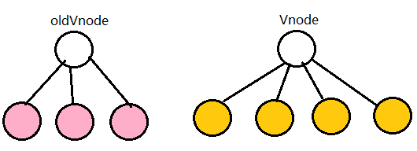

# diff算法

## 虚拟dom (virtual dom)

用一个简单的对象去代替复杂的dom对象

优点：

+ virtual dom很多时候都不是最优的操作，但它具有普适性，在效率、可维护性之间达平衡。

+ 提了一个中间层，实现跨平台

+ 有效减少渲染次数

## 分析diff

>比较只会在同层级进行, 不会跨层级比较。


diff的过程就是调用patch函数，就像打补丁一样修改真实dom。

```javascript
function patch (oldVnode, vnode) {
    if (sameVnode(oldVnode, vnode)) {
        patchVnode(oldVnode, vnode)
    } else {//当节点不值得比较，进入else中
        const oEl = oldVnode.el
        let parentEle = api.parentNode(oEl)//取得oldvnode.el的父节点，parentEle是真实dom
        createEle(vnode)//createEle(vnode)会为vnode创建它的真实dom，令vnode.el =真实dom
        if (parentEle !== null) {//parentEle将新的dom插入，移除旧的dom,当不值得比较时，新节点直接把老节点整个替换了
            api.insertBefore(parentEle, vnode.el, api.nextSibling(oEl))
            api.removeChild(parentEle, oldVnode.el)
            oldVnode = null
        }
    }
    return vnode//最后会返回vnode,唯一的改变就是之前vnode.el = null, 而现在它引用的是对应的真实dom。
}
// sameVnode函数就是看这两个节点是否值得比较 
function sameVnode(oldVnode, vnode){
    return vnode.key === oldVnode.key && vnode.sel === oldVnode.sel//这个key很关键，当设置了key值可以避免
}
// 两个节点值得比较时，会调用patchVnode函数
patchVnode (oldVnode, vnode) {
    const el = vnode.el = oldVnode.el//让vnode.el引用到现在的真实dom，当el修改时，vnode.el会同步变化。

    let i, oldCh = oldVnode.children, ch = vnode.children
    if (oldVnode === vnode) return//if (oldVnode === vnode)他们的引用一致，可以认为没有变化。
    if (oldVnode.text !== null && vnode.text !== null && oldVnode.text !== vnode.text) {//文本节点的比较
        api.setTextContent(el, vnode.text)
    }else {
        updateEle(el, vnode, oldVnode)
        if (oldCh && ch && oldCh !== ch) {//两个节点都有子节点，而且它们不一样，这样我们会调用updateChildren函数比较子节点，这是diff的核心
            updateChildren(el, oldCh, ch)
        }else if (ch){//只有新的节点有子节点 调用createEle(vnode)，vnode.el已经引用了老的dom节点，createEle函数会在老dom节点上添加子节点。
            createEle(vnode) //create el's children dom
        }else if (oldCh){//新节点没有子节点，老节点有子节点，直接删除老节点。

            api.removeChildren(el)
        }
    }
}
// 待补充
```

其中vnode的简单版结构

```javascript
// body下的 <div id="v" class="classA"><div> 对应的 oldVnode 就是
{
  el:  div  //对真实的节点的引用，本例中就是document.querySelector('#id.classA')
  tagName: 'DIV',   //节点的标签
  sel: 'div#v.classA'  //节点的选择器
  data: null,       // 一个存储节点属性的对象，对应节点的el[prop]属性，例如onclick , style
  children: [], //存储子节点的数组，每个子节点也是vnode结构
  text: null,    //如果是文本节点，对应文本节点的textContent，否则为null
}
```

需要注意的是，el属性引用的是此 virtual dom对应的真实dom，patch的<font color="red">vnode参数的el最初是null</font>，因为patch之前它还没有对应的真实dom。


下面是详细的子节点比较 <font color="red">updateChildren</font>

```javascript
updateChildren (parentElm, oldCh, newCh) {
    let oldStartIdx = 0, newStartIdx = 0
    let oldEndIdx = oldCh.length - 1
    // 将Vnode的子节点Vch和oldVnode的子节点oldCh提取出来
    let oldStartVnode = oldCh[0]
    let oldEndVnode = oldCh[oldEndIdx]
    let newEndIdx = newCh.length - 1
    let newStartVnode = newCh[0]
    let newEndVnode = newCh[newEndIdx]
    let oldKeyToIdx
    let idxInOld
    let elmToMove
    let before
    // 保证新节点或者旧节点有一个是遍历完。
    while (oldStartIdx <= oldEndIdx && newStartIdx <= newEndIdx) {
        if (oldStartVnode == null) {   // 对于vnode.key的比较，会把oldVnode = null
            oldStartVnode = oldCh[++oldStartIdx] 
        }else if (oldEndVnode == null) {
            oldEndVnode = oldCh[--oldEndIdx]
        }else if (newStartVnode == null) {
            newStartVnode = newCh[++newStartIdx]
        }else if (newEndVnode == null) {
            newEndVnode = newCh[--newEndIdx]
        }else if (sameVnode(oldStartVnode, newStartVnode)) {
            patchVnode(oldStartVnode, newStartVnode)
            oldStartVnode = oldCh[++oldStartIdx]
            newStartVnode = newCh[++newStartIdx]
        }else if (sameVnode(oldEndVnode, newEndVnode)) {
            patchVnode(oldEndVnode, newEndVnode)
            oldEndVnode = oldCh[--oldEndIdx]
            newEndVnode = newCh[--newEndIdx]
        }else if (sameVnode(oldStartVnode, newEndVnode)) {//如果是oldS和E匹配上了，那么真实dom中的第一个节点会移到最后
            patchVnode(oldStartVnode, newEndVnode)
            api.insertBefore(parentElm, oldStartVnode.el, api.nextSibling(oldEndVnode.el))
            oldStartVnode = oldCh[++oldStartIdx]
            newEndVnode = newCh[--newEndIdx]
        }else if (sameVnode(oldEndVnode, newStartVnode)) {//如果是oldE和S匹配上了，那么真实dom中的最后一个节点会移到最前，匹配上的两个指针向中间移动

            patchVnode(oldEndVnode, newStartVnode)
            api.insertBefore(parentElm, oldEndVnode.el, oldStartVnode.el)
            oldEndVnode = oldCh[--oldEndIdx]
            newStartVnode = newCh[++newStartIdx]
        }else {
           // 使用key时的比较
            if (oldKeyToIdx === undefined) {
                oldKeyToIdx = createKeyToOldIdx(oldCh, oldStartIdx, oldEndIdx) // 有key生成index表
            }
            idxInOld = oldKeyToIdx[newStartVnode.key]
            if (!idxInOld) {
                api.insertBefore(parentElm, createEle(newStartVnode).el, oldStartVnode.el)
                newStartVnode = newCh[++newStartIdx]
            }
            else {
                elmToMove = oldCh[idxInOld]
                if (elmToMove.sel !== newStartVnode.sel) {
                    api.insertBefore(parentElm, createEle(newStartVnode).el, oldStartVnode.el)
                }else {
                    patchVnode(elmToMove, newStartVnode)
                    oldCh[idxInOld] = null
                    api.insertBefore(parentElm, elmToMove.el, oldStartVnode.el)
                }
                newStartVnode = newCh[++newStartIdx]
            }
        }
    }
    // 节点遍历完，在跳出循环前做下面的操作
    // oldS > oldE表示oldCh先遍历完，那么就将多余的vCh根据index添加到dom中去（如上图）
    if (oldStartIdx > oldEndIdx) {
        before = newCh[newEndIdx + 1] == null ? null : newCh[newEndIdx + 1].el
        addVnodes(parentElm, before, newCh, newStartIdx, newEndIdx)
    }else if (newStartIdx > newEndIdx) {//S > E表示vCh先遍历完，那么就在真实dom中将区间为[oldS, oldE]的多余节点删掉
        removeVnodes(parentElm, oldCh, oldStartIdx, oldEndIdx)
    }
}
```




## 总结

key的作用主要是为了高效的更新虚拟DOM
v-for加key是为了添加唯一标识，让Diff算法可以正确识别节点并把它插入正确的位置，提高Vue对虚拟DOM的更新效率。

+ 尽量不要跨层级的修改dom

+ 设置key可以最大化的利用节点

+ 不要盲目相信diff的效率，在必要时可以手工优化 

一个图了解整个过程


## 参考文档

[解析vue2.0的diff算法](https://segmentfault.com/a/1190000008782928)