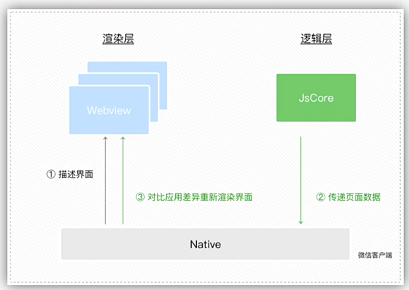
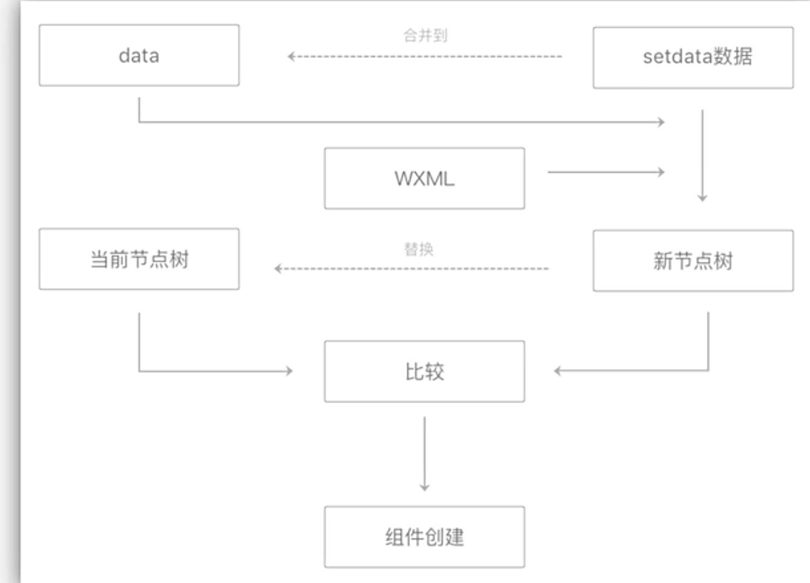
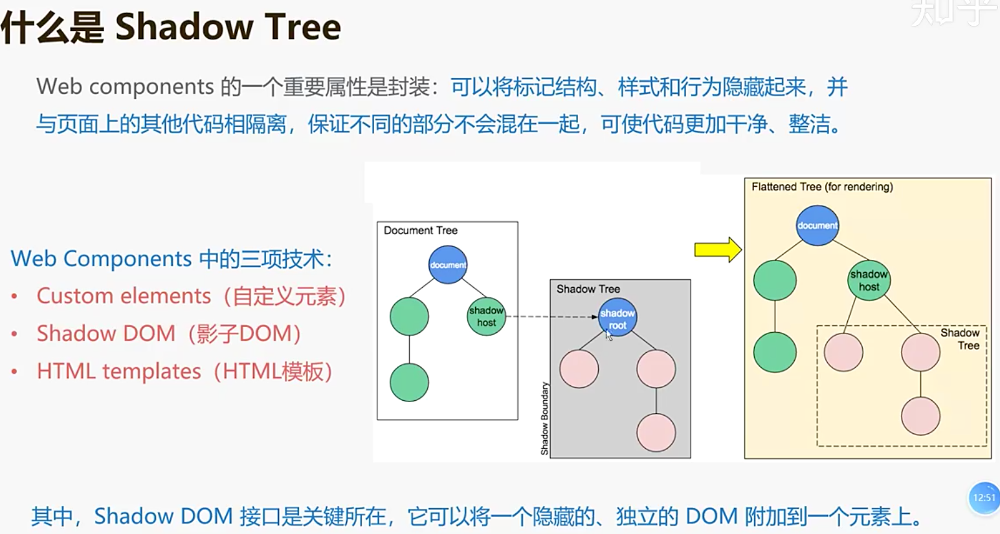

# 微信小程序知识点梳理

## 一、数据传输机制的不同

+ 小程序中只要是setData的值都会传输至视图层，不会做数据未更新的检查以及页面不需要数据的筛选排除，而且也不需要在data中预定义所有视图层所需要的属性值，未预定义的值调用setData也可以实现视图层的重新渲染

+ vue中只要this.xx的数据与当前data中的数据相等或者视图层未使用的data数据，这些数据就不会进行传输，所以也不会触发重新渲染；此外如果是没有在data中预先定义的属性值，调用this.xx,也不会触发视图

## 二、小程序的原理

### 1、双线程设计

  **小程序分为 渲染层（webview线程管理）和 逻辑层 （由客户端JavaScript解释引擎线程管理）**

优点：
  1. web技术是非常灵活，也意味着不安全，用户可以随意通过JavaScript修改Dom。而双线程可以更加保证用户和网站的安全。
  2. 可以防止恶意攻击者的XSS攻击
  3. 可以防止开发者恶意盗取用户信息
  4. 提升页面加载性能

### 2、双线程通信设计

小程序的渲染层和逻辑层都是直接和**微信客户端 Native** 直接进行通信，同时用也是用Native层于其他模块或者外部进行中转通信

  1. 在渲染层里，把WXML转换成对应的用于描述虚拟DOM树的JS对象
  2. 在逻辑层发生数据变更时，通过宿主环境提供的setData方法把变更 从逻辑层传递到Native，在转发到渲染层
  3. 在渲染层里，经过前后dom Diff，把差异应用到原来的Virtual Dom树上，更新界面
  

### 3、小程序的渲染过程

#### 初始渲染

  渲染层在接受初始数据（data）时，需要进行渲染层渲染。

  1. 初始渲染时，将初始数据套用在对应的WXML片段上生成节点树
  2. 初始渲染中得到data和当前节点树会保留下来用于重新渲染

优化方向：减少WXML中节点数量，可以有效降低初始渲染和重渲染的时间开销

#### 重渲染 

  渲染层在接受到更新数据（setData）数据，需要进行渲染层渲染

  1. 每次重渲染时，将data和setData数据套用到WXML片段上，得到一个新的节点树
  2. 将新的节点树和当前节点树 进行比较，拿到哪些数据需要更新、移动、添加、删除。。。
  3. 最后，将setData合并到data,并将新节点替换旧节点，用于下次重新渲染

### 自定义组件

  1. 生命周期会额外比页面生命周期多，例如：created、attached （实例插入页面节点树时）、ready、moved、deached、error
  2. behaviors组件间代码共享，类似于maxins[官方文档](https://developers.weixin.qq.com/miniprogram/dev/framework/custom-component/behaviors.html)
  3. Component 是 Page 的超集
   
   **shadow Tree**
   

  自定义组件的渲染过程 ---- shadow Tree

  区别于页面渲染过程，在自定义组件的渲染逻辑是，在逻辑层会生成一个Virtual Dom。将Virtual Dom通知到渲染层。包过更新过程也是在setData之后，在逻辑层进行Dom Diff然后将Diff结果给渲染层。渲染层拿到Diff信息进行更新Virtual Dom节点信息，更新页面。

  注意点：为了让两边的 Shadow Tree 保持一致，可以使用同步队列来传递信息 。更或者就是整到一起，一次性setData
  优点：
  优化方向： 可以用component去创建page页面。使dom Diff在逻辑层进行计算

### 原生组件

  1. hank方式同层渲染，将原生组件插入可控层级的方式。
  2. 可以减少一些用户交互的频繁通信

  

## 参考文档

+ [vue和微信小程序的区别、比较](https://segmentfault.com/a/1190000015684864)